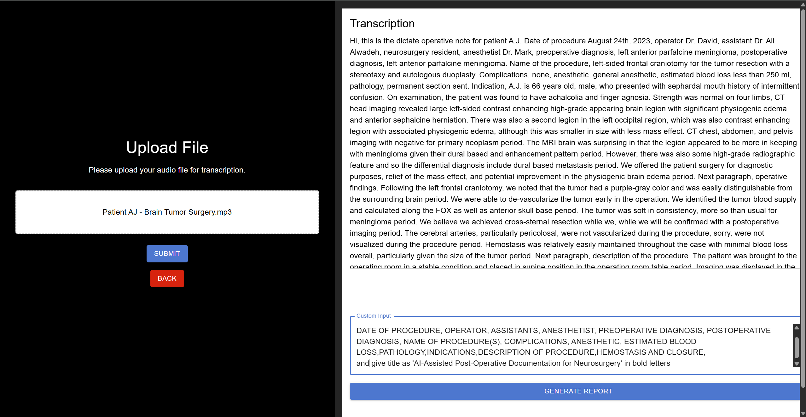

# AI-Assisted Post-Operative Documentation for Neurosurgery (DGIN 5201)

*AI assisted MVP application to generate post surgery documentation via using customized LLM Model implementation*

## Details: 
This application provides a streamlined workflow for converting audio files into text using Whisper AI, generating detailed reports with GPT-4, and storing these reports in a MySQL database via an Express.js backend. It also includes a React-based frontend for managing and displaying saved articles. This application is build using Docker based containers to ease deployment.

## How to run the code
1. Clone the repository or extract the submitted zip file to a desired location
2. User must be equipped with docker based tools to install the application
3. add your OpenAI API key to `react-app/.env` to field `VITE_OPEN_API_KEY='--'`
4. Run the command 
```
docker compose build --no-cache && docker compose up -d
```
5. Open the browser and type URL `http://127.0.0.1:9100`
6. Select the audio file from `'audio_samples/Patient AJ - Brain Tumor Surgery.mp3'` and click on the Submit Button
7. Give the application a couple of minutes to process the audio and display the transcription
8. Once the transcription is generated you can click on `generate report` for Actual Report with specific needs
9. This will take you to a new page where you can see the report, user can download as PDF and save it to datbase for later usage.

## Incase of any issues, here are some images of the application
1. Home Page

2. Upload Audio and Generate Audio Transcription via Whisper API

3. Show User Audio Transcription and generate the Custom Prompt automatically to generate final report

4. Report generation with LLM Model (Custom Model for Specificn Health Care Reporting)

4. Reports fetched via Express.JS Service 


## Technical Implementation Overview

* Front-End: React, HTML, CSS, JavaScript 

    - Features: 
    - Audio upload and transcription display 
    - Prompt input for generating reports with GPT-4 
    - Table views for saved articles 
    - Pagination, sorting, and user-friendly UI components (Material-UI) 

* Back-End (Express.js) 

    - Endpoints: 
    - POST /articles: Saves generated articles (reports) to MySQL 
    - GET /articles: Retrieves all saved articles 

* Integration: 

    - Connects to MySQL via mysql2/promise 
    - Receives and forwards transcription and prompt data to GPT-4 for report generation 
    - Audio-to-Text & AI Models 
    - Whisper AI: Converts audio files to text (speech-to-text) 
    - GPT-4: Generates structured reports based on the transcription and user-defined prompts 
    - Database (MySQL) 
    - Storage: Persists articles (ID, title, text) Enables retrieval and display of all saved articles on the React frontend 
    - Connectivity: Handled via Express.js environment variables (DB_HOST, DB_USER, DB_PASSWORD, DB_NAME) 
    - Deployment & Containerization: Docker-based approach for running React, Express, and MySQL in separate containers 
    - Security & Performance: Basic CORS setup for cross-origin requests 
    - MySQL used for structured data storage (MongoDB also possible depending on requirements) 